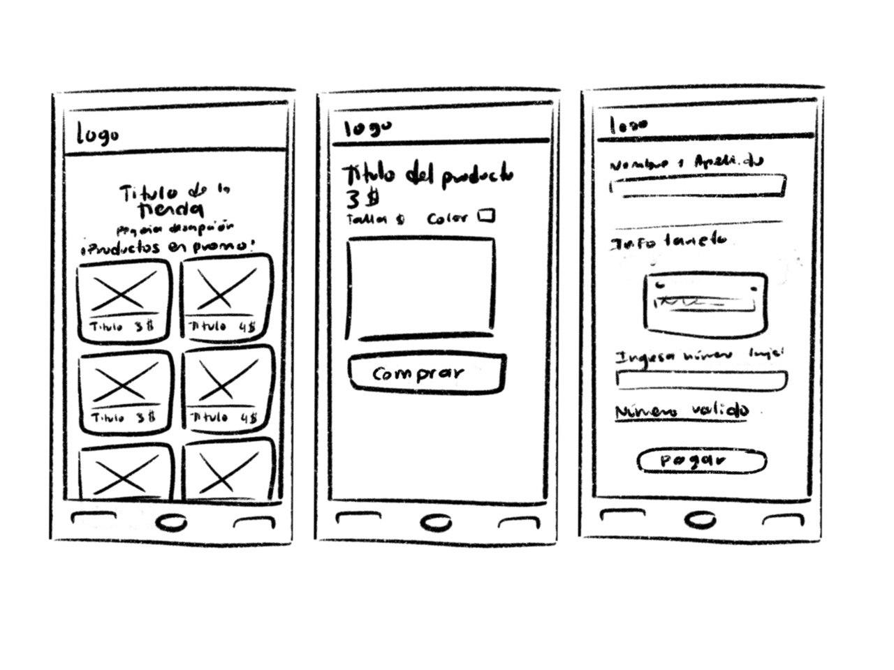

# Proyecto Tarjeta de crédito válida

## Índice

* [1. Sobre el Proyecto](#1-sobre-el-proyecto)
* [2. Problemática y Solución](#2-problemática-y-solución)
* [3. Prototipo en baja y alta fidelidad](#3-prototipo-en-baja-y-alta-fidelidad)

## 1.  Sobre el Proyecto
La idea del proyecto es construir una aplicación web que le permita a un usuario validar
el número de tarjeta de crédito. 
## 2. Problemática y Solución
Nuestro usuario es un comprador reciente de manera online, encuentra una tienda, y va a pagar los artículos que eligió, su objetivo y lo que espera, es poder realizar una compra segura con su tarjeta de crédito. Por lo cual, implementamos una sección de validación de número de tarjeta para que el usuario confirme que su compra se realizará con éxito. 

Debe ser algo fácil de entender y que genere confianza (desde el diseño hasta los mensajes que se le den), ya que los procesos de pago siempre producen incertidumbre en los usuarios.

## 3. Prototipo en baja y alta fidelidad
Empezamos el proyecto bocentando y diseñando para saber que queremos lograr, luego de validarlo con las compañeras, pasamos al prototipo de alta fidelidad.

